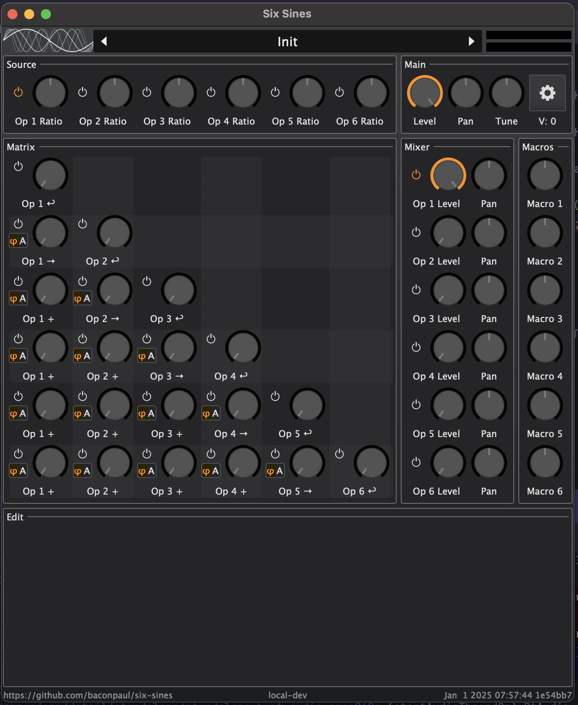
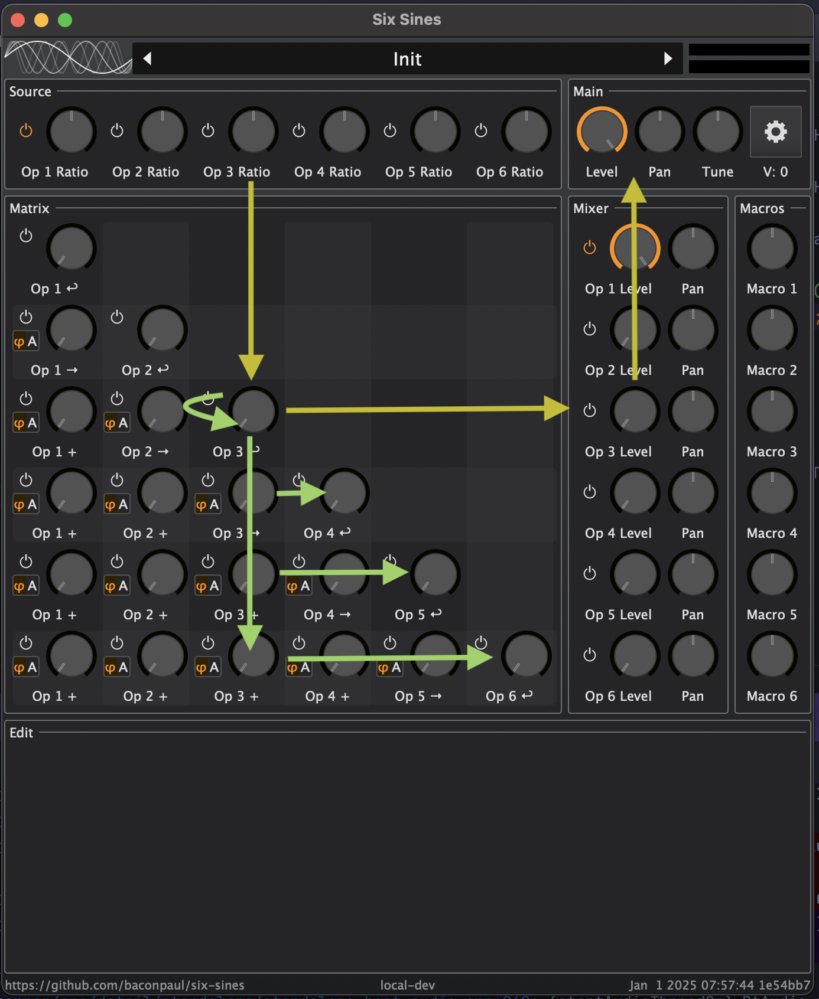
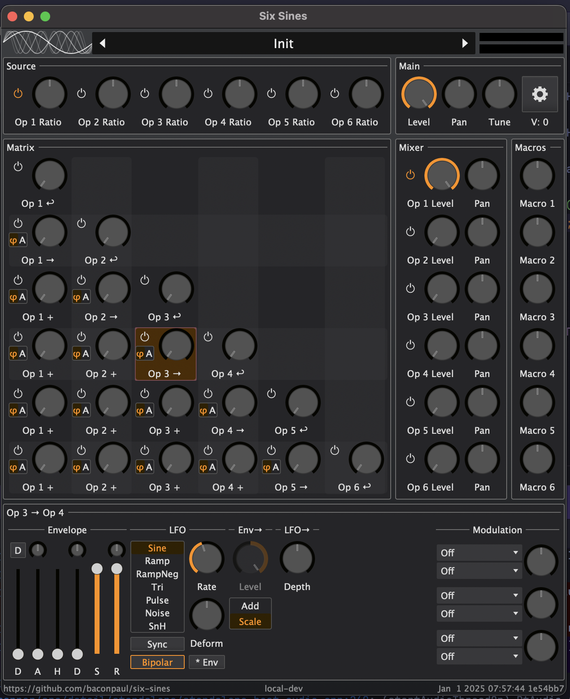

# Six Sines Manual

Six Sines is a small synth based on audio rate modulation (techniques
often called "Phase Modulation" and "Digitial Ring Modulation").
It has an architecture which allows lots of modulation and a synth
engine with a couple of tricks which make it sound pretty good.

You can download the latest release or Nightly version of
Six Sines [here](https://github.com/baconpaul/six-sines/releases).
Six Sines is free and open source software. You can get, study,
modify, and re-use the source for it [here](https://github.com/baconpaul/).

And following in the legacy of other PM and FM synths, it is not
exactly easy to program. The sort of 'symmetric/maximal' signal
path design approach exacerbates this problem, as does the relatively
thin manual you are reading right now. But don't fear! You can have
fun with the synth anyway.

## How the synthesis works, basically

Its a 6 operator FM synth, more or less. 

Each of the 6 operators can output to audio or can modulate
themselves (feedback) or subsequent operators. So operator 3
can feedback its own signal or modulate operators 4, 5, and 6.

Modulation of subseuqent operators can be phase modulation
(the 'phi' symbol) or digital ring/audio-rate-amplitude modulation
(the 'A' symbol).

But the real trick of sound design with the thing is the
modulation architecture. Each knob on the screen represents
a node with an independent envelope and LFO per voice.
So each operator, operator modulation application,
operator feedback, and operator level can be indpendently
and individualyy modulated.

Woof. That's work. But its fun!

## The Main Interface

 

The Six Sines interface has a patch selector and main menu
with a VU meter at the top, then presents sections for each
of the core functions. The operators span the top with the
knob for each being their ratio, The modulation matrix is below,
the mixer to the side, and then the main output above. The 
macro section participates in modulation.

Each knob has a 'power' button which means the node doesnt
run in a voice in any capacity, and subsequently uses no CPU.

## The Visual Signal Path

 

Here we show the signal path for operator 3. Yellow lines
show audio signals presented for auido output, and green
lines show audio signals which are used for modulation.

It starts at the "Ratio" node which sets the frequency
of the operator. Then the audio signal travels to the matrix
where it first intersects the op3 feedback node and self modulates.
The resulting audio travels to the mixer where it is leveled
by an independent op3 audio node, and then is mixed into the main
output.

The same signal travels further into the modulation matrix
providing modulation for ops 4, 5, and 6.

## Inside a node

Once you click a knbo to select it or edit it the bottom
part of the user interface shows the modulation screen for
that node. Node 'classes' (ratio, cross matrix, feedback, mixer, main)
have subtly different modulation screens but the core idea is an 
envelope, an LFO, application depth controls, and then performance
modulation areas.

The performance modulation area allows you to map MIDI and
Macros to the modulation and level beyond the internal modualtors.

## Envelopes, Triggering, and Voice Modes

The synth has two voicing modes, a Polyphonic and a Monophonic 
mode. In the polyhonic mode, it additionally has a per-key piano mode.
These modes control how and when voices are created.

In polyphonic mode with piano mode off, a voice is created on
every key press.

In polyphonic mode with piano mode on, a voice is created
on a key press unless there is already a voice sounding on
that key, in which case that voice is retriggered.

In monophonic mode, a voice is created only when no voice is 
playing. If a subsequent key press happens, the voice is moved
and retriggered.

Retrigering retriggers envelopes and each enveope can trigger
on one of four ways.

- On voice start only. If you use this it can sound like a stuck
note if you aren't careful. Its not. 
- On voice start or on a voice being re-keyed when not keyed (or
"on gate changed" in modular speak)
- On any key press
- On release. In on-release mode, the envelope is gated if the 
voice is ungated, so resuming a gate gesture on a note will
release the OnRelease envelope.

The default for an envelope is 'Patch Default' which is set in the
settings screen, but you can override.

## The Settings Screen

Press the COG icon at the top of the UI to get the settings
screen, where you can control MPE, Mono mode, pitch bend depth,
and more.

## Oversampling

The setting screen contains an oversampling control. The Six Sines oversampling
strategy has the engine run at a fixed rate mostly independnt of
host sample rate which is stored in the patch and you control.

Mostly, because our resampler (a short FIR interpolator) works
way better at round multiple downsampling. 2.5x is a lot better than
2.61x or such. So our oversample levels are fixed offsets from
either 44.1 or 48khz. If you choose, say, "132.3/144khz" as you engine 
sample rate, if your host sample rate is a multiple of 44.1 we will
choose the lower, and of 48 the higher.

You may need to adjust oversampling in some high feedback cases.
It of course burns cpu as it goes up and for most patches
the default 2.5x is just fine.

## Screen Reader and Accessible Support

Six Sines supports screen readers and accessible gestures, making
the UI and programming model as inscrutable to these assistive technologies
as it is to users with a visual display. Since the UI is quite big there's
a few extra features for screen reader navigation.

First, standard edit gestures should work on all controls, and I tried
really hard to make sure tab order makes sense and labels are reasonable. If
you find one which is wrong, please just drop a note on discord or github.

The structure of the UI is that knbos (like "Op3 feedback level") a panel
in the bottom 1/4 of the screen to edit the modulators and stuff. This panel
arrives when you mouse click or edit the knob. A few features make this
easier to navigate for a screen reader.

If on a knob in the top third, `Command-A' will arm that knob (namely select the
knob modulation panel in the area below)

If on a knob in the top third, `Command-J` will jump to the control panel in the
bottom

And finally from anywhere in the UI, `Command-N` will expose a menu allowing
you to focus any of the focusable top-section knobs or preset manager.

## Good Luck, and..

Good luck! Its fun. But tricky. If you want to add to this manual
please do send a PR over.