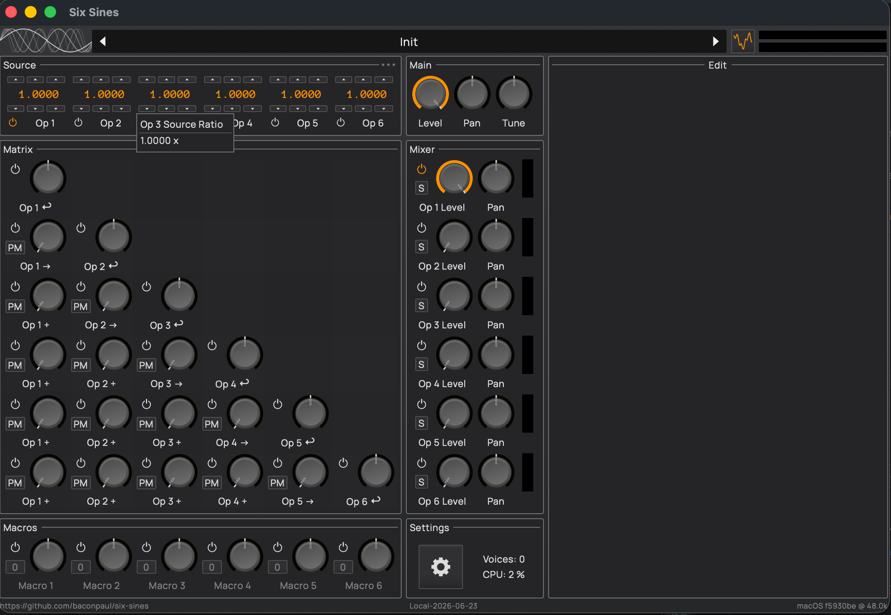
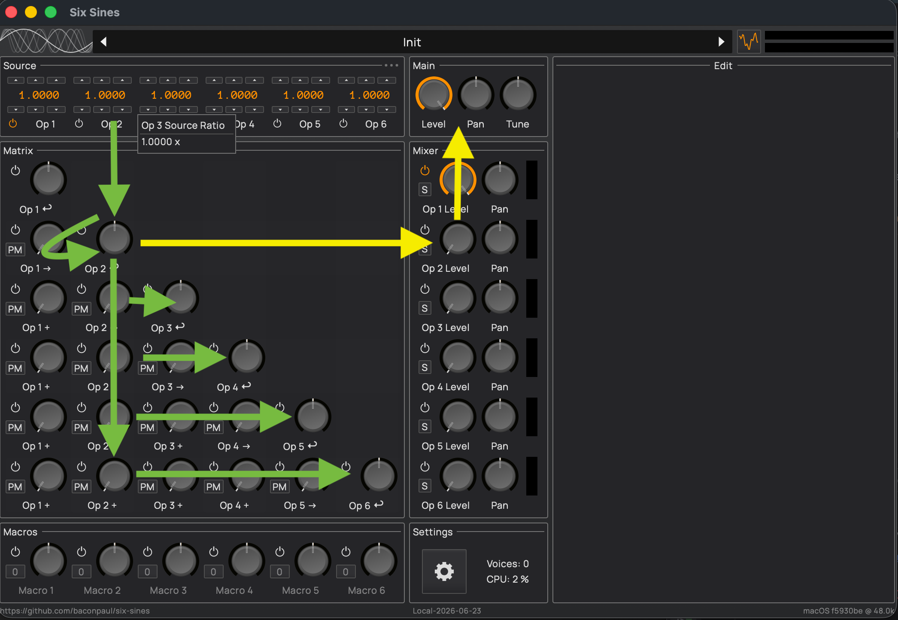
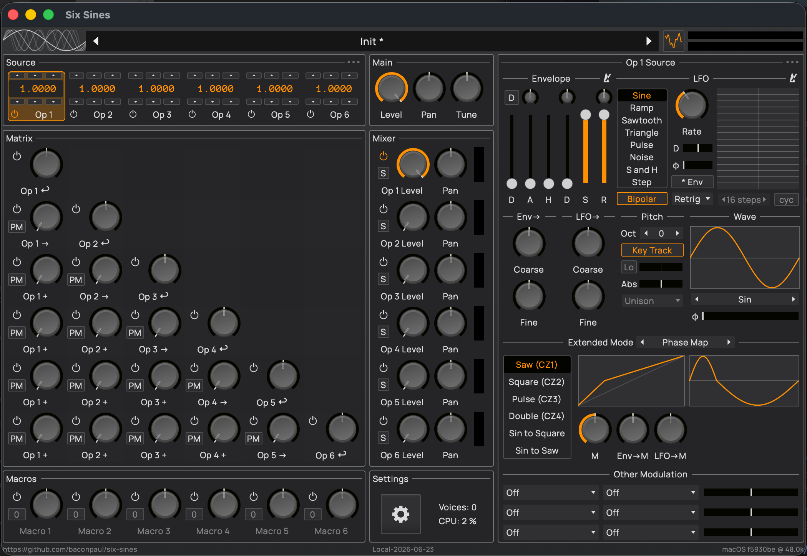
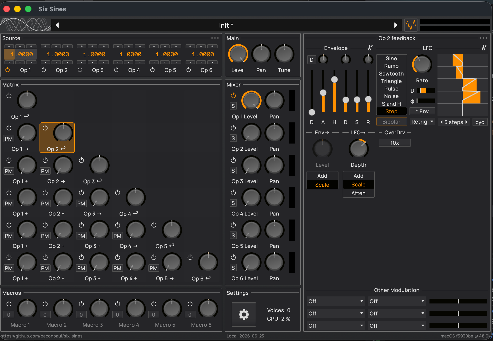
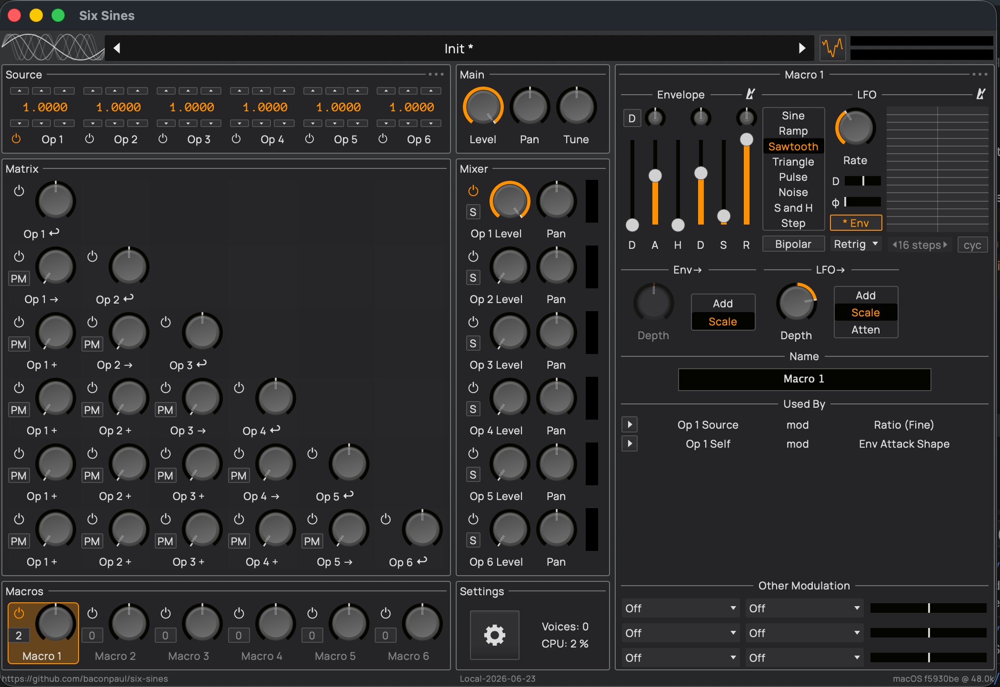
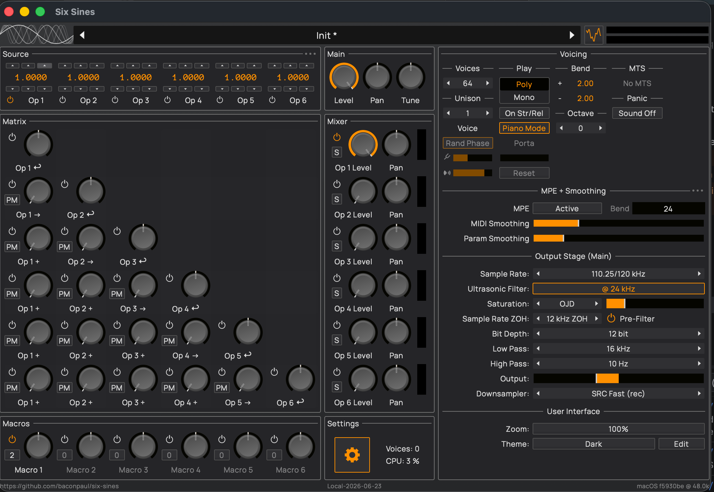
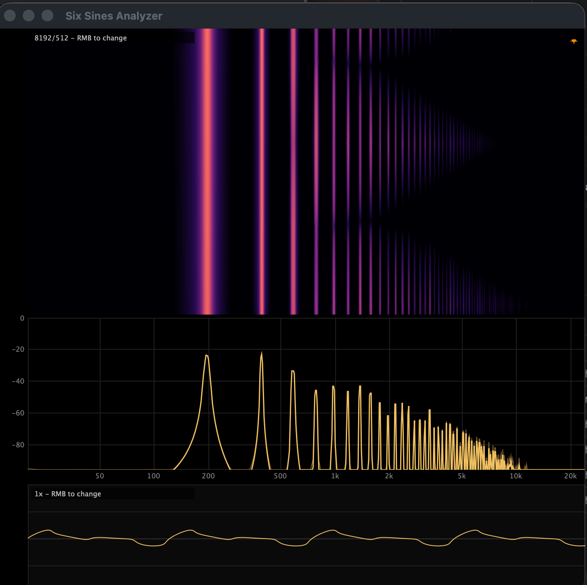
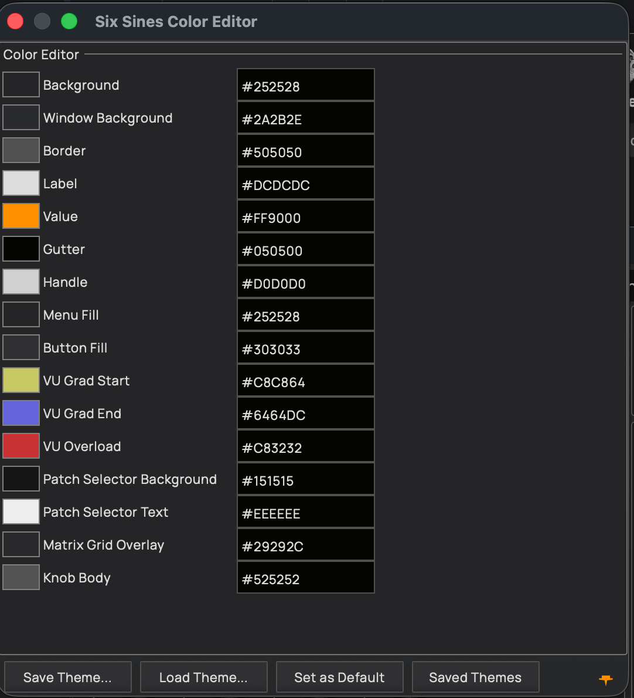

# Six Sines Manual

*This manual covers Six Sines 1.2. If you are running 1.1 the interface
will look quite different — 1.2 re-laid the whole UI "sideways" and added
a pile of features. See the [changelog](changelog.md) for the full list.*

Six Sines is a small synth based on audio rate modulation (techniques
often called "Phase Modulation" and "Digital Ring Modulation").
It has an architecture which allows lots of modulation and a synth
engine with a couple of tricks which make it sound pretty good.

You can download the latest release or Nightly version of
Six Sines [here](https://github.com/baconpaul/six-sines/releases).
Six Sines is free and open source software. You can get, study,
modify, and re-use the source for it [here](https://github.com/baconpaul/six-sines).
And please read the [acknowledgements](ack.md) for a list of thanks.

And following in the legacy of other PM and FM synths, it is not
exactly easy to program. The sort of 'symmetric/maximal' signal
path design approach exacerbates this problem, as does the relatively
thin manual you are reading right now. But don't fear! You can have
fun with the synth anyway.

## I don't want to read a manual. Are there any good YT vids?

Yes! As part of the [one synth challenge](https://www.kvraudio.com/forum/viewtopic.php?t=618178&start=45) in Feb 2025, 
KVR users [Taron](http://www.taron.de) made a series of videos showing how to
do sound design in six sines.

- [Video One - Six Sines First Steps](https://youtu.be/fP4wNFigUt4?si=uKoq_MVoYYqzQkN3)
- [Video Two - Exploring AM](https://youtu.be/JU1Yzfb5U_c?si=lyaKbKRye48EvmSz)
- [Video Three - FM and AM](https://www.youtube.com/watch?v=X7RTZz2G2ig)
- [Video Four - Making a simple drumpset](https://www.youtube.com/watch?v=HnpFRSw-QBc)

Thanks so much for these, Taron! They are great! (They were recorded against
1.1, so a few controls have moved, but the sound-design ideas all still apply.)

## How the synthesis works, basically

Its a 6 operator FM synth, more or less. 

Each of the 6 operators (we call them "sources") can output to audio or can
modulate themselves (feedback) or subsequent operators. So operator 3
can feedback its own signal or modulate operators 4, 5, and 6.

Modulation of subsequent operators can be phase modulation
(the 'phi' symbol) or digital ring/audio-rate-amplitude modulation
(the 'A' symbol). The mod matrix also offers TZ-linear FM, exponential FM,
and several scaling modes for the ring modulation.

A source doesn't have to be a plain sine. In 1.2 each source can run an
*extended mode* — phase-remap (CZ-style) distortion, a resonant sweep,
or a noise generator — and operator 1 can take the plugin's audio
sidechain input as its source. More on those below.

But the real trick of sound design with the thing is the
modulation architecture. Each knob on the screen represents
a node with an independent envelope and LFO per voice.
So each operator, operator modulation application,
operator feedback, and operator level can be independently
and individually modulated. And in 1.2 the macros became full
per-voice modulators too (we call them SuperMacros).

Woof. That's work. But its fun!

## The Main Interface

The window is a landscape layout. Across the very top is the patch
selector and main menu, an analyzer toggle, and a VU meter.

Below that the window is divided into regions:

- **Sources** — the 6 operators. The main knob for each is its ratio,
  and each has a power button.
- **Matrix** — the modulation/routing matrix. The diagonal is each
  operator's self-feedback; the cells above route one operator into a
  later one (PM, FM, or RM).
- **Main** — the output stage: overall level, pan, and fine tune, plus
  the button into the Play / Settings screen.
- **Mixer** — the per-operator audio level, pan, and solo, each with its
  own little VU meter.
- **Macros** — the six SuperMacros, sitting in a strip under the matrix.
- **Settings strip** — voice count and CPU readout sit under the mixer.
- **Edit panel** — the tall panel down the right side. When you click a
  knob anywhere in the UI, this panel fills with that node's editor
  (envelope, LFO, modulation, and so on).

You can swap the vertical order of the Sources and Matrix regions from
the main menu ("Sources Above Matrix" / "Matrix Above Sources").

Each knob has a 'power' button which means the node doesn't
run in a voice in any capacity, and subsequently uses no CPU.

## The Visual Signal Path

Here we trace the signal path for operator 3. The colored lines are an
illustration drawn over the screenshot, not something the UI itself
draws: **yellow** lines show audio signals headed for the audio output,
and **green** lines show audio signals used for modulation.

It starts at the **Ratio** node, which sets the frequency of the
operator (or, with an absolute-Hz offset or extended mode, shapes the
source further). The audio signal then travels into the **matrix**,
where it first hits the op3 feedback node on the diagonal and can
self-modulate. That audio travels to the **mixer**, where it is leveled
by an independent op3 audio node, and then mixed into the **main**
output.

The same op3 signal also travels further into the matrix, where it
provides modulation for operators 4, 5, and 6.

Because every one of those stops — ratio, feedback, each matrix cell,
mixer level, main output — is its own node with its own envelope, LFO,
and modulation slots, you have an enormous amount of independent control
over how the signal is shaped through time. Click any of them and its
editor opens in the panel down the right side.

## Sources and the Operators

Click a source to edit it in the right-hand panel. Beyond the envelope,
LFO, and modulation that every node has (see below), a source adds:

- **Ratio editor** — the classic knob, plus a new segmented widget for
  dialing ratios directly. Press the '...' in the source area to swap
  between the knob and the segmented editor. Fractional type-ins like
  `1.5` work, and there are jog buttons to step by harmonics.
- **Coarse and fine tune**, and an **absolute-Hz offset** so a node can
  be detuned by a fixed frequency rather than a ratio.
- **Waveform** — a sine by default, plus a collection of TX-style and
  "window" waveforms useful for AM/RM work.
- **Extended mode** — `None`, `Phase Map`, `Resonant Sweep`, or `Noise`:
  - **Phase Map** is a CZ-style phase-distortion that warps the
    waveform's phase for brighter, vocal-ish timbres.
  - **Resonant Sweep** runs a windowed inner oscillator whose pitch
    sweeps, in the spirit of the Casio CZ resonant waveforms.
  - **Noise** is a noise generator with white, pink, tilt (the `N`
    control sets the tilt), and an LFSR / chip-style "sequence" mode.

  Extended modes have two parameters, **M** and **N**, and both can be
  driven from the node's envelope and LFO, so the distortion or sweep can
  evolve across a note.
- **Audio input** — operator 1 can set its source to the plugin's audio
  sidechain input instead of an oscillator, which is mostly useful for
  some pretty destructive FM-the-incoming-signal work. (The input is
  upsampled to the engine rate, so expect a little latency.)

## Inside a node

Once you click a knob to select it, the right side of the UI shows the
modulation editor for that node. Node 'classes' (ratio/source, cross
matrix, feedback, mixer, main) have subtly different editors, but the
core idea is the same: an **envelope**, an **LFO**, **application depth**
controls, and a **performance modulation** area.

- The **envelope** is a DAHDSR. In 1.2 every envelope can **temposync**,
  the curve shapes (attack/decay/release) are themselves modulatable in
  the matrix, and the envelope's **rate** is available as a modulation
  target (exponential, ±8×). There's also a 'retrigger from zero' mode.
- The **LFO** offers the usual curve shapes plus a **step sequencer**.
  It has rate, deform, and start-phase controls, temposync, and a
  bipolar toggle. A **song-position** run mode locks the LFO's phase to
  the host timeline instead of to note attack. On amplitude-like nodes
  the LFO gains **add / scale / attenuate** modes, mirroring the
  envelope's options.
- The **performance modulation** area gives you three slots, each
  mapping a source (MIDI, a macro, velocity, MPE pressure, the new
  bipolar **MPE timbre**, an LFO, or an envelope) to a target with a
  depth. This is how you wire MIDI and macros into a node beyond its
  internal modulators.

You can copy and paste an envelope, an LFO, or a whole node's modulation
between nodes.

## SuperMacros

In 1.1 the macros were simple assignable knobs. In 1.2 each of the six
macros became a **SuperMacro**: a full per-voice modulation source with
its own name, DAHDSR envelope, LFO, and a 3-slot modulation matrix, plus
a power switch. So a macro can now be a knob you move, *and* a modulator
that evolves on its own, all at once.

Click a macro to edit it. To see where a macro is being used, open its
in-use display — each consumer is listed and you can jump straight to
that node.

## The Output / Reconstruction Stage

The main output node feeds a configurable reconstruction stage, found on
the Play / Settings screen. It's a chain of optional steps you can use to
deliberately rough up the sound:

- **Saturation** — `None`, `Soft`, or an OJD-style drive, with a drive
  amount.
- **Sample Rate ZOH** — zero-order-hold decimate the signal to a chosen
  rate (12–48 kHz). A pre-filter (a Cytomic SVF) tames the aliasing this
  introduces.
- **Bit Depth** — a bit-depth crush.
- **High Pass** — a low-frequency cut to kill DC.

These let you go from clean down to a 'beat up' or 'old' sound. They can
also produce delightfully unexpected artifacts under high feedback or
saturation — use your ears.

## Envelopes, Triggering, and Voice Modes

The synth has two voicing modes, a Polyphonic and a Monophonic 
mode. In the polyphonic mode, it additionally has a per-key piano mode.
These modes control how and when voices are created.

In polyphonic mode with piano mode off, a voice is created on
every key press.

In polyphonic mode with piano mode on, a voice is created
on a key press unless there is already a voice sounding on
that key, in which case that voice is retriggered.

In monophonic mode, a voice is created only when no voice is 
playing. If a subsequent key press happens, the voice is moved
and retriggered.

Retriggering retriggers envelopes and each envelope can trigger
on one of four ways.

- On voice start only. If you use this it can sound like a stuck
note if you aren't careful. Its not. 
- On voice start or on a voice being re-keyed when not keyed (or
"on gate changed" in modular speak)
- On any key press
- On release. In on-release mode, the envelope is gated if the 
voice is ungated, so resuming a gate gesture on a note will
release the OnRelease envelope.

The default for an envelope is 'Patch Default' which is set in the
Play / Settings screen, but you can override it per node.

## The Play / Settings Screen

Click the play-mode area of the Main panel to open the Play / Settings
screen in the edit panel. This is where the synth-wide controls live:

- **Play** — poly / mono / piano mode, voice count and unison, the
  voice limit, portamento and portamento continuation, and the patch
  default trigger mode.
- **Bend** — independent up and down pitch-bend depths.
- **MPE** — MPE enable and bend range. As of 1.2 these (and the
  smoothing times below) live on the engine, not the patch, so loading a
  preset no longer wipes your MPE configuration. You can save them as
  user defaults that seed the engine on startup.
- **Smoothing** — the MIDI/MPE/note-expression and parameter-automation
  smoothing times.
- **Zoom and Theme** — UI scaling and the active color theme (also
  reachable from the main menu).
- **Output stage** — the saturation / sample-rate / bit-depth / high-pass
  chain described above.

## Oversampling

The Six Sines oversampling strategy has the engine run at a fixed rate
mostly independent of the host sample rate, which is stored in the patch
and you control.

Mostly, because our resampler (a short FIR interpolator) works
way better at round multiple downsampling. 2.5x is a lot better than
2.61x or such. So our oversample levels are fixed offsets from
either 44.1 or 48khz. If you choose, say, "132.3/144khz" as your engine 
sample rate, if your host sample rate is a multiple of 44.1 we will
choose the lower, and of 48 the higher.

You may need to adjust oversampling in some high feedback cases.
It of course burns cpu as it goes up and for most patches
the default 2.5x is just fine.

## The Analyzer

Press the button next to the VU meter (or "Show Analyzer" in the main
menu) to open the analyzer window. It shows the playing spectrum and a
waveform scope, which is handy when you're chasing what a feedback or
saturation setting is actually doing. The window defaults to staying on
top so you can watch it while you tweak.

## Theming and the Color Editor

Six Sines ships with light and dark themes, and 1.2 adds a full **Color
Editor** so you can recolor the whole UI. Open it from the main menu
("Color Editor..."), tweak the palette, and use "Set As Default" to keep
your theme across sessions. You can save and load themes as files and
they show up under a User Themes submenu.

## Patches, Authors, and Saving

Six Sines comes with a large set of factory patches organized by
category, plus your own user patches, all reachable from the main menu
or by jogging the patch selector. 1.2 adds a patch **author** field —
set yours with "Set Author" in the main menu and it will be stamped on
patches you save. The patch selector shows a dirty indicator when the
current patch has unsaved changes.

## Design Mode Helpers

While building a patch it's useful to hear nodes that are powered off, or
to silence everything when you flip a power switch. The main menu's
Design Mode submenu has helpers for exactly this — "Run all nodes
independent of power" and "All sounds off on power toggle", available for
the current session or as a saved preference.

## Screen Reader and Accessible Support

Six Sines supports screen readers and accessible gestures, making
the UI and programming model as inscrutable to these assistive technologies
as it is to users with a visual display. Since the UI is quite big there's
a few extra features for screen reader navigation.

First, standard edit gestures should work on all controls, and I tried
really hard to make sure tab order makes sense and labels are reasonable. If
you find one which is wrong, please just drop a note on discord or github.

The structure of the UI is that knobs (like "Op3 feedback level") have a
panel down the right side to edit the modulators and stuff. This panel
arrives when you mouse click or edit the knob. A few features make this
easier to navigate for a screen reader.

If on a knob in one of the main sections, `Command-A` will arm that knob
(namely select the knob modulation panel in the edit area).

If on a knob in one of the main sections, `Command-J` will jump to the
edit panel.

And finally from anywhere in the UI, `Command-N` will expose a menu allowing
you to focus any of the focusable section knobs or the preset manager.

## Good Luck, and..

Good luck! Its fun. But tricky. If you want to add to this manual
please do send a PR over.
